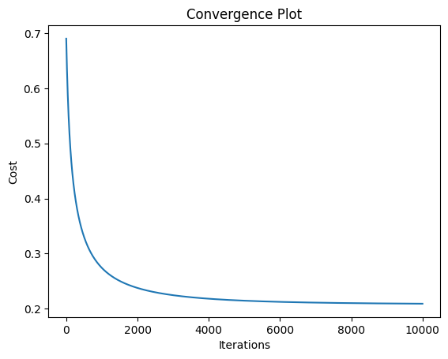
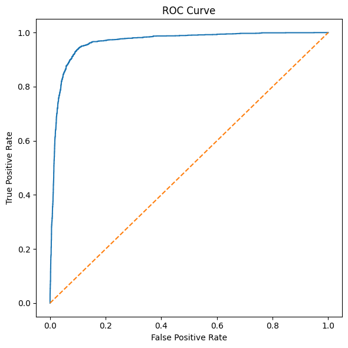
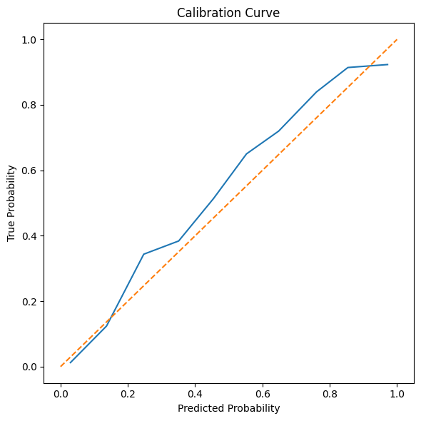

# Intro to Logistic Regression with Log-Loss and L2 (Ridge) Regularization

### **Predicting late package deliveries using real last-mile logistics data**

**DATA** \
[LaDe: The First Comprehensive Last-mile Delivery Dataset from Industry](https://huggingface.co/datasets/Cainiao-AI/LaDe)

**Sklearn Logistic Regression Model Results**

Accuracy  : 0.9233 \
Precision : 0.8590 \
Recall    : 0.8276 \
F1 Score  : 0.8430 \
ROC AUC   : 0.9649

**Our Logistic Regression Model Results**

Accuracy : 0.9228 \
Precision: 0.8190 \
Recall   : 0.8855 \
F1 Score : 0.8509 \
ROC AUC  : 0.9650

Our logistic regression model achieved an accuracy of **92.28%** on the on-time/late delivery evaluation set. At the chosen probability threshold, it correctly flags **88.55%** of all late deliveries (recall), ensuring most truly late packages are identified by the model. When the model predicts a delivery will be late, it is correct **81.90%** of the time (precision). The resulting F1 score of **85.09%** summarizes this balance between catching late deliveries and limiting false positives. Finally, the ROC AUC of **0.9650** (as visualized in the ROC curve) indicates that in **~96.5%** of randomly chosen pairs of on-time and late instances, the model assigns a higher probability score to the late delivery.

In practice, missing a late delivery (a false negative) is more costly than incorrectly predicting one (a false positive), so we selected a lower decision threshold of 0.35 rather than the default 0.50. This increases recall and allows the system to flag a greater proportion of at-risk deliveries earlier, as confirmed by the model's well-calibrated probabilities.

 

  
   
  
  

 

## **Logistic Regression**

> **Note**: GitHub mobile does **not** render LaTeX math formulas.  
> Please view this project on a **desktop browser**.

Binary classification models are those where the output of the prediction is either zero or one, namely, identifies if something is within a category spectrum (say cat or dog, true or false). Logistic Regression uses this methodology and accurately classifies two distinct categories using the sigmoid function. 

Our linear classification model is represented as:

$$f_{w,b}(\mathbf{X}) = g(\mathbf{X} \mathbf{w} + b \cdot \mathbf{1})$$

where $$\mathbf{z} = \mathbf{X} \mathbf{w} + b \cdot \mathbf{1}$$ is the linear combination of features and $g(z)$ is the sigmoid (logistic) function.

For each training example $x^{(i)}$ in the Matrix $\mathbf{X}$, the logistic regression algorithm takes a linear combination of the features $z$, then passes it through the sigmoid $g(z)$ function to squash it into a probability between 0 and 1, which becomes our model's prediction $f_{w,b}(\mathbf{x})$. We can interpret the results of our logistic regression function as a probability, namely, if we observe that $f_{w,b}(\mathbf{x}) = P(y = 1 \mid \mathbf{x}; w, b)$ where $g(z) = 0.7$, we say that there is a 70% chance our prediction is y = 1.

The full derivation of logistic regression can be found here: [Standford: Logistic Regression Slides](https://web.stanford.edu/~jurafsky/slp3/slides/5_LR_Apr_7_2021.pdf)

### **Sigmoid Function**

The sigmoid function is denoted as:

$$g(z) = \frac{1}{1 + e^{-z}}$$

and serves as our function that shrinks the outputs of our prediction $z$.

$$
\begin{cases}
\text{When } z < 0: & g(z) \text{ is between } 0 \text{ and } 0.5 \\
\text{When } z = 0: & g(z) = 0.5 \\
\text{When } z > 0: & g(z) \text{ is between } 0.5 \text{ and } 1
\end{cases}
$$

Our computed value can now inform if our prediction corresponds to either a 0 or 1, which is something decided through the decision boundary.

### **Decision Boundary**

The decision boundary is set threshold which will inform our final computed prediction as to what categorical decision to lean on.

By default, we start with a 0.5 threshold:

$$
\text{if } f_{w,b}(\mathbf{x}) \ge 0.5, \quad \hat{y} = 1; \quad \text{else } \hat{y} = 0
$$

If we want our prediction to be more conservative, we can change the threshold say:

$$
\text{if } f_{w,b}(\mathbf{x}) \ge 0.7, \quad \hat{y} = 1; \quad \text{else } \hat{y} = 0
$$

where now we expect our model to be at least 70% confident to consider y = 1.

The decision boundary is manually set at a given threshold by the nature of the classification problem itself and is directly influenced by real world observations. Decision boundaries can be experimentally tunned and are as complicated as their higher order polynomial terms, meaning they can bend according to the data in question. 

### **Log-Loss Cost Function**

The cost function for logistic regression looks similar to linear regression yet behaves differently, most importantly, our prediction term; $f_{w,b}(x^{(i)}) = g(w \cdot x^{(i)} + b)$ changes the way we think of our computed error.

The Cross-Entropy (Log-Loss) cost function is given by:

$$
J(w, b) = \frac{1}{m} \sum_{i=0}^{m-1} \text{loss}(f_{w,b}(x^{(i)}), y^{(i)})
$$

Where $y^{(i)}$ is our actual value and $f_{w,b}(x^{(i)})$ is the prediction for a single example. The derivation of the logistic cost function through Maximum Likelihood Estimation (MLE) can be quite extensive; refer to the slides attached.

We know that our loss function for a single example takes the shape of: 

$$
\text{loss}(f_{w,b}(x^{(i)}), y^{(i)}) = -y^{(i)} \log(f_{w,b}(x^{(i)})) - (1 - y^{(i)}) \log(1 - f_{w,b}(x^{(i)}))
$$

where if $y^{(i)} = 0$, the left-hand term is eliminated:

$$
\text{loss}(f_{w,b}(x^{(i)})) = -\log(1 - f_{w,b}(x^{(i)}))
$$

and when $y^{(i)} = 1$, the right-hand term is eliminated:

$$
\text{loss}(f_{w,b}(x^{(i)})) = -\log(f_{w,b}(x^{(i)}))
$$

which ensures that as we iterate through our minimization algorithm, the decision boundary parameters w,b are updated so that predicted probabilities for positives move toward 1 and for negatives toward 0.

### **(L2) Ridge Regularization**

Recall that with multiple regression, increasing the number of features in our model will naturally increases the fit of our data. This means that the more features we use, the higher the model will bend according to the data we are using. Although this might seem as a positive, what we end up with is a unwanted phenomenom called Overfitting. 

Overfitting is best described as a model that no longer generalizes well. This means that our model now only predicts exactly what the training data looks like, without accounting for natural variations that happen in real world examples. 

To reduce overfitting, we apply ridge regularization to penalize our model per additional feature included. Ridge Regularization (L2) penalizes each feature weight by lowering its influence in the model. This penalty will take the form:

$$
\frac{\lambda}{2m} \sum_{j=0}^{n-1} w_j^2
$$

where lambda $\lambda$ is our new regularization hyperparameter term which controls the size to which our penalty is enforced. Like alpha in gradient descent, lambda is enforced experimentally, different values influence the penalty to all of the model's individual weights, we often start from small values like 0.01 and increase as needed. 

We include this penalty in our cost function which takes the form of:

$$
J(w, b) = \frac{1}{m} \sum_{i=0}^{m-1} 
\left[
-y^{(i)} \log(f_{w,b}(x^{(i)})) - (1 - y^{(i)}) \log(1 - f_{w,b}(x^{(i)}))
\right] + \frac{\lambda}{2m} \sum_{j=0}^{n-1} w_j^2
$$

with our penalty included, regardless if we include more weights, we will reduce their overall influence in the model by lowering their size.

### **Gradient Descent**

In logistic regression, we update the weights $w$ and $b$ iteratively as we did in previous models. We start by computing the partial-derivates of $w$ and $b$ with respect to our cost function;

$$
\frac{\partial J(w,b)}{\partial w_j} = 
\frac{1}{m} \sum_{i=0}^{m-1} (f_{w,b}(x^{(i)}) - y^{(i)}) x_j^{(i)} + \frac{\lambda}{m} w_j
$$

$$
\frac{\partial J(w,b)}{\partial b} = 
\frac{1}{m} \sum_{i=0}^{m-1} (f_{w,b}(x^{(i)}) - y^{(i)})
$$

which is indeed similar to our counter-part regression models but now includes our regularization penalty and a different prediction term. At every iteration our gradient informs the direction and magnitude at which our current parameters lie. 

After computing the gradient, we move downwards by performing our standard parameter update, multiplied by alpha, we move downhill until our model converges.

Repeat until convergence {
    
$$
w_j := w_j - \alpha \frac{\partial J(w,b)}{\partial w_j}
$$

$$
b := b - \alpha \frac{\partial J(w,b)}{\partial b}
$$

}

